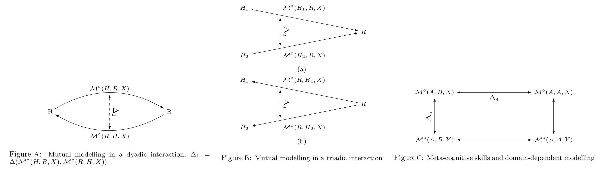
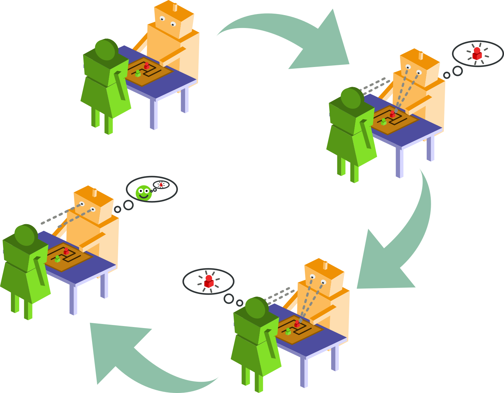
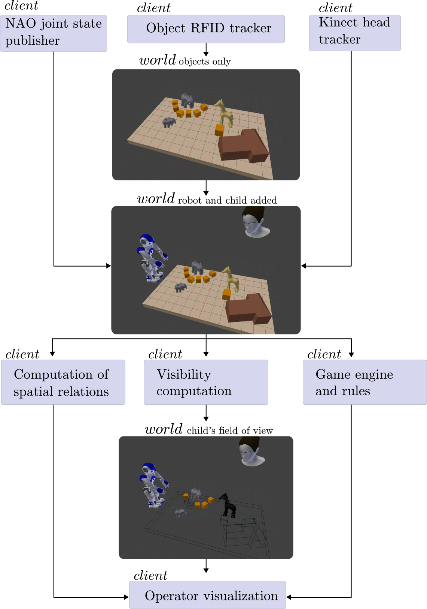
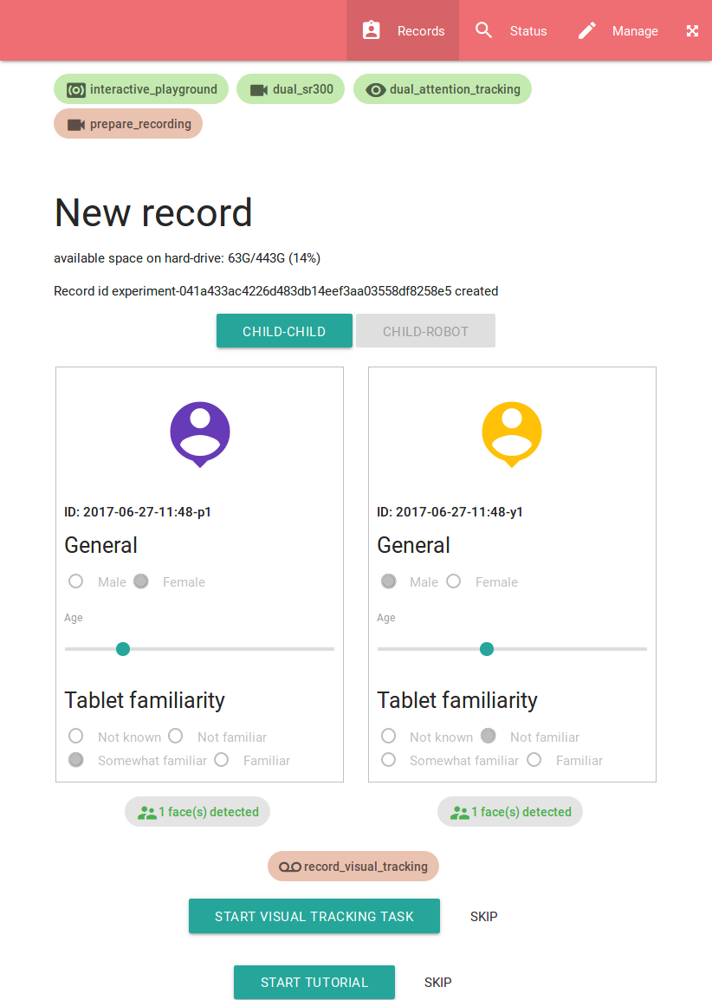

1. Explanation of the work carried out by the beneficiaries and Overview of the progress 
========================================================================================


1.1 Objectives
--------------

### 1.1.1 Summary of the context and overall objectives of the project 

Human social dynamics rely upon the ability to effectively attribute beliefs,
goals and percepts to other people. This lays at the core of human interactions:
normal human social interactions depend upon the recognition of other sensory
perspectives, the understanding of other mental states, and the recognition of
complex non-verbal cues of attention and emotional state.

With the rapid development of social robotics, meaning robots that interact with
humans in usual human environments like homes, transferring these cognitive
skills to robots is an important, if difficult, scientific challenge, with a significant
societal impact with regard to our future interactions with robots. This
scientific endeavour is explicitly set as one of the EU priorities within the
Horizon 2020 framework, which emphasizes the need to endow artificial systems
with new cognitive capabilities, beyond "repetitive problem solving"[^4].


In this context, the DoRoThy project aims first at advancing our **understanding
of the complex socio-cognitive mechanisms that underpin human social
interactions**, and, second, to investigate **how such mechanisms could by
applied to social robots**.

The project has originally a strong emphasise on *mutual modelling*: endowing
artificial agents with skills to "read the minds" of others.
In effect, in the scientific summary of the DoRoThy project, we underlined how
humans exhibit powerful mechanisms to *represent* and *interpret* what
others know or intend. DoRoThy originally proposed to build on a
*symbolic cognition* paradigm to endow robots with similar social
skills.

After an initial period of 6 to 8 months of prototyping, experimentation and
consultation with other senior academics at the host institution (see report on
[WP1](#wp1) and [WP2](#wp2)), we came to the conclusion that a shift of paradigm
was required if the project was to have a significant impact on the field.

Therefore, the researcher decided to shift his modelling paradigm from *symbolic
cognition* and traditional, logic-based AI techniques, to the **potentially
disruptive deep learning techniques**.


To better reflect this change, the titles of work packages have been modified, as
indicated below.

- Work Package 1: *Formal Model of Representation-level Meta-Cognition for Robots* becomes *Models of social cognition for human-robot interaction*;
- Work package 2: *Experiment 1: Standard False-Belief Experiment* becomes *Experimental Frameworks for the Study of Social HRI*;
- Work package 3: *Experiment 2: Representation-level Meta-Cognition* becomes *The PInSoRo dataset of Social HRI*;
- Work package 4 is not modified.

[^4]: In description of the FET Proactive "Knowing, doing and being: cognition
  beyond problem solving", retrieved on 25/08/14 from
  https://ec.europa.eu/programmes/horizon2020/en/node/822.


1.2 Explanation of the work carried per WP
------------------------------------------

### WP1: *Models of social cognition for human-robot interaction* {#wp1}

The objective of this work package was to design a formal, logic-based,
model of theory of mind. **This work package has evolved to investigate a broader
model of social cognition, with an accompanying experimental methodology**.


In this section, we report on the work conducted by the researcher to:

1. investigate and frame the specific question of mutual modelling from the
  complementary perspectives of 3 disciplines (developmental psychology;
  psychololinguistics; formal epistemology) (task T1.1);
2. integrate these perspectives into a new possible model applicable to
   Human-Robot Interaction (the *Socio-Cognitive Robotic Awareness Model*) (task
   T1.2);
3. reframe the original question of mutual modelling into the broader question
   of *how interactions shape the emergence of social behaviours*, and propose
   an experimental methodology to investigate this question (T1.3 & T1.4).

**Summary of the deliverables**

| | |
|------------------------------------------------------|---------------------------------------------|
| D1.1: Publication of a review of relevant literature | Published at HRI2015 [@lemaignan2015mutual] |
| D1.2: Formal model of experiment 1 and 2 | *(no longer applicable, replaced by D1.4)*  |
| D1.3: Publication of an experimental methodology to investigate models of social interaction | Publication submitted at HRI2018, under review: [@lemaignan2018freeplay]   |

Additional deliverables, not present in the original project:

| | |
|------------------------------------------------------|---------------------------------------------|
| D1.4: Model of social cognition | The *Socio-Cognitive Robotic Awareness Model*, presented below |


<!-- %%%%%%%%%%%%%%%%%%%%%%%%%%%%%%%%%%%%%%%%%%%%%%%%%%%%%%%%%%%%%%%%%%%% -->
<!-- %%%%%%%%%%%%%%%%%%%%%%%%%%%%%%%%%%%%%%%%%%%%%%%%%%%%%%%%%%%%%%%%%%%% -->
<!-- %%%%%%%%%%%%%%%%%%%%%%%%%%%%%%%%%%%%%%%%%%%%%%%%%%%%%%%%%%%%%%%%%%%% -->

#### Scientific foundations of mutual modelling

The first task T1.1 of WP1 relates to identifying the scientific &
interdisciplinary foundations of the theory of mind, as well as the underlying
models used in the different discipline.


We report here on the litterature research conducted in three fields
(developmental psychology; psycho-linguistics; formal epistemology) where the
question of the modelling of the others agents play an important role.

##### Mutual Modelling and Developmental Psychology

###### Connections vs. representations

In [@flavell1990developmental], Flavell relates perspective taking
*Level 1* to establishing *cognitive connections* (I see, I hear, I
want, I like, I fear...), in contrast to perspective taking *Level 2*
that relates to manipulating *representations*. This is exemplified by
*appearance-reality* tasks, like the *elephant mask* experiment proposed
in [@flavell1990developmental]: 3-years old children are not able to
tell that an experimenter hidden behind a large elephant mask but who
speaks normally *looks* like an elephant, *sounds* like the
experimenter, and *really is* the experimenter. It appears that, while
those children are able to explicitly manipulate cognitive connections
(they know for instance that these are largely independent of each other
and that they can evolve over time) and know as well that their own
connections are independent of those of other people, they do not think
that one concept can *seriously* (i.e., non playfully) hold
several, possibly conflicting, representations.

This *connection-representation* account appears to be a significant
component of a general theory of mind (one needs to recognize that the
same object/concept may have different, serious, representations to then
accept false beliefs for instance). @Fig:representation-level
illustrates this difference between cognitive connections and
representations in an imaginary human-robot interaction scenario. The
*visual* perspective of the baby and the mother are represented: a robot
endowed with perspective-taking level 1 is able to compute that the baby
looks at the plug and the mother looks at the baby.
*Representation*-level perspective taking, on the other hand, would
require the robot to represent what the socket means to the baby (an
attractive affordance), and what the baby’s behaviour represents to the
mother (a potential danger).

{#fig:representation-level width="0.9\columnwidth"}

##### Developmental pathopsychology

The false belief experiment that we have mentioned above, was proposed
by Baron-Cohen in the frame of his research on autistic spectrum
disorders (he shows that autistic children seem to actually lack a
theory of mind and suggests this as the primary cause of their social
impairments), and Frith and Happé further note in  [@frith1994autism]
that this specific deficit of autism has led to a large amount of
research which proved, in turn, highly beneficial to the study of the
development of theory of mind in general. They reference
in [@frith1994autism] eight such tasks (@tbl:mentalizing-tasks),
identified during the study of social cognition by autistic children.
Each of them is proposed in two versions: one does not require
mentalizing, while the other does require it. One of these tasks, for
example, required children to distinguish emotions, namely happy/sad
faces on one hand (*situation-based* emotion), and surprised faces on
the other (*belief-based* emotion) [@baron1993children]. Another task,
based on the *penny-hiding game*, contrasts the two conditions in terms
of *object occlusion* vs. *information occlusion* [@baron1992out] (we
detail it hereafter). These tasks prototypically illustrate social
meta-cognition: one need to represent and reflect on someone else
representations (and not only perceptions), and they are not addressed
by today’s research on social robots.

Experimental protocols in research on autistic spectrum disorders are
often striking by their apparent straightforwardness because of the
careful choice of interaction modalities: since autistic children
frequently exhibit impairments beyond social ones (such as motor or
linguistic ones), the experiments must be designed such that they
require only basic cognitive skills beyond the social abilities that are
tested. The Sally and Anne task, for instance, requires the observing
child to be able to visually follow the marble, to remember the true
location of the marble, to understand simple questions (“Where will
Sally look for her marble?” in Baron-Cohen’s protocol [@baron1985does])
and eventually to give an answer, either verbally or with a gesture –
the two first points being actually explicitly checked through
questions: “Where is the marble really?” (reality control question) and
“Where was the marble in the beginning?” (memory control question).

Likewise, current social robots have limited cognitive skills (no fast
yet fine motor skills, limited speech production and understanding,
limited scene segmentation and object recognition capabilities, etc.)
and such tasks that effectively test a single cognitive skill (in this
case, mentalizing) in near isolation are of high relevance for
experimental social robotics.

  **No mentalizing required**         **Mentalizing required**
  ----------------------------------- ------------------------------------------------------
  Ordering behavioural pictures       Ordering mentalistic pictures [@baron1986mechanical]
  Understanding see                   Understanding know [@perner1989exploration]
  Protoimperative pointing            Protodeclarative pointing [@baron1989perceptual]
  Sabotage                            Deception [@sodian1992deception]
  False photographs                   False beliefs [@leslie1992domain]
  Recognizing happiness and sadness   Recognizing surprise [@baron1993children]
  Object occlusion                    Information occlusion [@baron1992out]
  Literal expression                  Metaphorical expression [@happe1993communicative]

  : Tasks requiring or not mentalizing to pass, listed by Frith and
  Happé in [@frith1994autism]{#tbl:mentalizing-tasks}

Frith and Happé’s list (@tbl:mentalizing-tasks) is in that regard
especially interesting in that it mirrors pairs of task (ones which do
not require mentalizing with similar ones which do require mentalizing),
thus providing control tasks. *Object occlusion* vs. *Information
occlusion* is one example of a (pair of) task(s) which evidence
representation-level perspective taking through *adaptive deception*:
during a simple game, the experimenter adapts its strategy
(deceptive/non-deceptive behaviour) to the representation skills of its
child opponent. The experimental setting is derived from the
penny-hiding game protocol originally proposed by Oswald and
Ollendick [@oswald1989role] and replicated and extended by Baron-Cohen
in [@baron1992out], who describes it as a two-person game in which the
subject is actively involved, either as a guesser or as a hider. The
hider hides the penny in one hand or the other, and then invites a
guess. The game is repeated several time before switching the roles.
Baron-Cohen proposes a specific index to rate the level of the players
based on the idea of *information occlusion*: minimally, the hider must
ensure *object occlusion* (the penny must not become visible to the
guesser), while good hiders, with representation-level perspective
taking skills, develop strategies (like random hand switching or deictic
hints at the wrong hand) to prevent the guesser to find the penny
(*information occlusion*). One could imagine a similar protocol adapted
to robotics: the robot would play the role of the experimenter, adapting
on-line its behaviour to what it understands of the perspective taking
capabilities of the children, and would consequently require
*second-order*, *representation-level* perspective taking from the
robot.

##### Higher-order Theory of Mind

While a great deal of research concerns itself with *first-order* theory
of mind, *higher-order* (and particularly, second-order) ToM are also
studied. Verbrugge and Mol [@verbrugge2008learning] describe the
different levels in the following terms:

> To have a first-order ToM is to assume that someone’s beliefs,
> thoughts and desires influence one’s behavior. A first-order thought
> could be: *He does not know that his book is on the table*. In
> second-order ToM it is also recognized that to predict others’
> behavior, the desires and beliefs that they have of one’s self and the
> predictions of oneself by others must be taken into account. So, for
> example, you can realize that what someone expects you to do will
> affect his behavior. For example, “(I know) he does not know that I
> know his book is on the table” would be part of my second-order ToM.
> To have a third-order ToM is to assume others to have a second-order
> ToM, etc.

Perner shows in [@perner1988higher] that $2^{nd}$-order ToM is mastered
around 8 years old, and Flobbe [[*et al. *]{}]{}propose
in [@flobbe2008children] a set of three tasks (a second-order false
belief task, a strategic game and a sentence comprehension test) that
require second-order mentalizing to succeed. The second-order false
belief task that they propose (known as the *Chocolate bar task*)
effectively evidence higher-order ToM:

> John and Mary are in the living room when their mother returns home
> with a chocolate bar that she bought. Mother gives the chocolate to
> John, who puts it into the drawer. After John has left the room, Mary
> hides the chocolate in the toy chest. But John accidentally sees Mary
> putting the chocolate into the toy chest. Crucially, Mary does not see
> John. When John returns to the living room, he wants to get his
> chocolate.

Flobbe then asks the subjects: *“Where is the chocolate now?”* (reality
control question), *“Does John know that Mary has hidden the chocolate
in the toy chest?”* (first-order ignorance question), *“Does Mary know
that John saw her hide the chocolate?”* (linguistic control question),
and *“Where does Mary think that John will look for the chocolate?”*
(second-order false belief question). Besides, Flobbe asks the
participants to justify their answer (*“Why does she think that?”*). In
her study, 82% of a group of 40 children (M=9 year old) successfully
passed the task.

While literature on higher-order of mutual modelling is generally
scarce, *agreement* and *common belief* is another interesting social
situation: Verbrugge [@verbrugge2009logic p. 664] reports after an
experiment by Mant and Perner [@mant1988child] where a child is
disappointed by his father who changed the announced plan to go
swimming. In one condition, the child and the father had previously
mutually agreed, while in the other, no explicit agreement took place
(to a child observer, it actually appears that the situation is
**worse** if the child and the father did **not** previously explicitly
agree). Children before ten do not distinguish between the two
conditions, and Verbrugge’s proposed explanation relies on the concept
of *social commitment*, which implies the *common belief* between the
two agents that the father *intends* to go swimming and the child is
*interested* in going swimming.

Common belief (“we believe that we believe that we believe that... we
agreed”) is defined in epistemic logic as an infinite recursion
(“$\infty$-order” ToM), and Verbrugge suggests that this mutual
modelling mechanism is therefore harder to master for children than
2$^{nd}$-order ToM for instance.

#### Mutual Modelling in Psycholinguistics and Collaborative Learning

Dillenbourg proposes in [@sangin2007partner] a model to represent mutual
modelling situations. He uses the notation
[[$\mathcal{M}(A, B, X)$]{}]{} to denote “$A$ knows that $B$ knows $X$”
(equivalent to the epistemic logic notation
$\mathsf{K}_{A}\mathsf{K}_{B}X$ that we present in the next section).
This notation does not mean that $A$ has an explicit, monolithic
representation of $B$: it must be understood as an abstraction referring
to possibly complex socio-cognitive processes. Besides, he refer to the
*degree of accuracy* of the model as
[[$\mathcal{M}^{\circ}(A, B, X)$]{}]{}.

He parametrizes and assesses the mutual modelling *effort* through 3
variables:

1.  Tasks vary a lot with respect to how much they require mutual
    understanding. The *grounding criterion* [@clark1986referring]
    [[$\mathcal{M}^{\circ}_{min}$]{}]{}refers to how important it is to
    mutually share a piece of information $X$ to succeed the task $T$.
    It can be computed as the probability to succeed $T$ despite the
    fact $X$ is not grounded. $\mathcal{M}^{\circ}_{min}(A,B,X)$ can be
    estimated from the correlation between
    [[$\mathcal{M}^{\circ}(A, B, X)$]{}]{} and the task performance.

2.  Before any specific grounding action, there is usually a non-null
    probability that $X$ is mutually understood by $A$ and $B$
    ([[*e.g. *]{}]{}$X$ is part of $A$’s and $B$’s cultures, it is
    manifest to co-present subjects or simply there is not much space
    for misunderstanding or disagreement about $X$). He notes the
    theoretical accuracy of initial grounds
    $\mathcal{M}^{\circ}_{t_0}(A,B,X)$.

3.  The cost of grounding $X$ refers to the physical and cognitive
    effort required to perform a grounding act $\alpha$: a verbal repair
    ([[*e.g. *]{}]{} rephrasing), a deictic gesture, a physical move to
    adopt one partner’s viewpoint, etc. This cost varies according to
    media features [@clark1991grounding].

These notations lead to simple representations of mutual modelling
during interactions, and Dillenbourg derives several questions out of
this model. Adapted to a human-robot interaction situation,
@fig:mm (A) represents for instance a dyadic interaction (we
use $H$ to denote a human, while $R$ stands for a robot). $\Delta_1$
illustrates what Dillenbourg calls the *symmetry* question ([*Is the
accuracy of my model related or not to the accuracy of your model?*]{}).

{#fig:mm}

With triads (two humans $H_1$ and $H_2$ and a robot $R$), we may compute
the accuracy of 6 models [[$\mathcal{M}^{\circ}(H_1, H_2, X)$]{}]{},
[[$\mathcal{M}^{\circ}(H_2, H_1, X)$]{}]{},
[[$\mathcal{M}^{\circ}(H_1, R, X)$]{}]{},
[[$\mathcal{M}^{\circ}(R, H_1, X)$]{}]{},
[[$\mathcal{M}^{\circ}(R, H_2, X)$]{}]{} and
[[$\mathcal{M}^{\circ}(H_2, R, X)$]{}]{}.

This leads to two *triangle questions* relevant to HRI
(@fig:mm (B)): Do $H_1$ and $H_2$ have the same accuracy
when modelling the robot $R$?
($\Delta_2 = \Delta({{\mathcal{M}(H_1, R, X)}},
{{\mathcal{M}(H_2, R, X)}})$), and conversely, what may lead $R$ to
model more accurately $H_1$ or $H_2$?
($\Delta_3 = \Delta({{\mathcal{M}(R, H_1, X)}}, {{\mathcal{M}(R, H_2, X)}})$).

Finally, Dillenbourg also suggests a *rectangle question*: how self-
versus other modelling compares ($\Delta_4$ in
@fig:mm (C))? This gives an indication of meta-cognitive
skills of the agents. We can also question if the modelling skills
depend upon what aspects are being modeled ($X$ or $Y$) which would
explain vertical differences ($\Delta_5$ in @fig:mm (C)).

This model, designed in the context of human collaboration, evidences
questions that are relevant as well to human-robot interactions.

#### Formal Epistemology


The above model of mutual modelling is meant as a practical tool to
reason on knowledge dynamics in group interactions and it does not look
at being a formal model, whereas formal epistemology, a subfield of the
philosophy of mind, focuses on this question.

*Modal logics* look at the formal representation of *possible worlds*,
[[*i.e. *]{}]{}the *possibility* or *necessity* of certain assertions to
hold, and is naturally suited to build mathematical representations of
situations such as “*the robot knows \[the baby may not know what a
power socket is\]*”.

The *epistemic modal logic* in particular (see [@hendricks2008epistemic]
for an overview and references) focuses on the formal representation of
knowledge and beliefs of agents, with the operators
$\mathsf{K}_{i}\varphi$ (epistemic operator: agent $i$ knows $\varphi$)
and $\mathsf{B}_{i}\varphi$ (doxatic operator: agent $i$ believes
$\varphi$). Every possible logical propositions belong then to possible
*worlds* (noted $w$), that are *accessible* ([[*i.e. *]{}]{}compatible)
or not to one’s beliefs and knowledge.

Single-agent epistemic systems can naturally extend to multi-agent
systems [@fagin1995reasoning chapt. 4]: if $p$ stands for “the power
socket is dangerous”,
$\mathsf{K}_{mother}p \wedge \mathsf{K}_{mother}\neg\mathsf{K}_{baby}p$
states that the mother knows that the socket is dangerous, and also
knows that the baby is not aware of this. This provides a formal tool to
represent mutual models (the *order* of mutual modelling as discussed in
the context of developmental psychology is here directly related to the
nesting depth of the epistemic operator).

This approach has led to applications to the representation of knowledge
dynamics on concrete, albeit arguably toy, scenarios: van Ditmarsch
presents for instance in [@ditmarsch2002description] the formal
description of possible Cluedo strategies based on what players know
about other players’ knowledge, and along the same line, Verbrugge and
Mol analyse mutual modelling in a strategic game with imperfect
information (derived from Mastermind) in [@verbrugge2008learning].

Amongst the several *modal operators of knowledge* that have been
developed, the *common-knowledge* operator $\mathsf{CK}$ is of
particular interest. If we define the *shared-knowledge* operator
$\mathsf{EK}$ as
$\mathsf{EK}_J\varphi \leftrightarrow \bigwedge_{i \in J}\mathsf{K}_i\varphi$,
[[*i.e. *]{}]{}$\varphi$ is *shared knowledge* amongst the group $J$ iff
every agent in $J$ knows $\varphi$, then
$\mathsf{CK}_J\varphi \leftrightarrow
\mathsf{EK}_J\varphi \wedge \mathsf{EK}_J\mathsf{EK}_J\varphi \wedge
\mathsf{EK}_J\mathsf{EK}_J\mathsf{EK}_J\varphi \wedge ...$,
[[*i.e. *]{}]{}$\varphi$ is shared knowledge, and it is also shared
knowledge that $\varphi$ is shared knowledge, etc. (this presentation
follows [@herzig2014logics]). This illustrates how epistemic logic can
represent non-trivial social knowledge situations.

Verbrugge further investigates the social aspect of epistemic logics
in [@verbrugge2009logic] and proposes a survey of epistemic logic
applications to *social reasoning*. He underlines both the limits of
epistemic logic for that purpose (common epistemic systems assume for
instance
$\mathsf{K}_{i}\varphi \rightarrow \mathsf{K}_{i}\mathsf{K}_{i}\varphi$,
which reads “$i$ knows $\varphi$” implies “$i$ knows that $i$ knows
$\varphi$”, [[*i.e. *]{}]{}$i$ can always introspect, a rather idealized
model of human cognition) and the recent advancement towards modelling
*human* social cognition, which implies for instance limited
rationality. One of these attempts is formalized as a *doxastic
epistemic logic* by van Ditmarsch and Labuschagne
in [@ditmarsch2007beliefs], with an explicit focus on modelling *theory
of mind* mechanisms. This model builds upon *dynamic epistemic
logic* [@ditmarsch2007dynamic] (DEL, epistemic logics augmented with
mechanisms for knowledge changes), and the modelling of agents’ degrees
of belief through a *preference* accessibility relation.

The mathematical objects build from these different modal logics are
natural candidates for transposition into representational systems and
controllers for robots. Historically in robotics, the main research
perspective has been towards the *action logics*, and in particular the
influential *situation calculus* (a propositional logic initially
proposed by McCarthy, and fully axiomatized in the context of robotics
by Levesque [[*et al. *]{}]{}in [@levesque1998foundations], which led to
the [golog]{} logic programming language [@levesque1997golog]). Many
other action logics have been proposed including modal logics like PDL
(*Propositional Dynamic Logic*).

Recent efforts have focused on bridging action logics (that deal with
*ontic* actions, [[*i.e. *]{}]{}actions which have tangible, physical
consequences) with epistemic logics (that deal with *epistemic* actions,
[[*i.e. *]{}]{}knowledge changes). Van Ditmarsch proposes
in [@ditmarsch2010from] for instance a solution to embed a practical
subset of situation calculus into a dynamic epistemic logic, and Herzig
provides in [@herzig2014logics] a broader overview of the interplay
between current action and epistemic logics.

From a practical perspective however, implementations of these logics
into practical reasoners or programming languages remain rare. The
development of *Description Logics* (DL) in the knowledge representation
community, along with effective, practical tools (like reasoners) is a
possible path forward, since DL semantics overlap to some extend with
modal logics [@baader2003description chap. 4.2.2], and *Description
Logics* have already been successfully used in robotics
(see [@lemaignan2012symbolic] for a review).


#### An initial model of Socio-Cognitive Awareness for robots

As seen in the previous section, symbolic approaches to social cognition work by first building a mental
model of the interacting humans. This is typically done by a combination
of 3D situation assessment (the robot builds and update a semantic 3D
model of its environment) and visual perspective taking (based on the
estimation of the pose of the human head). This permits the computation
of allocentric, and more importantly, egocentric spatial relations
between the spatial entities in the environment (we call it *social
situation assessment*). See [WP2]{#wp2} for the work done on implementing such a
situation assessment module.

This geometric computations are then turned into symbolic
representations, typically using logical statements (embedded in logic
programming [@tenorth2009knowrob] or ontologies [@lemaignan2010oro]).

The robot creates and continuously updates one symbolic model per
agent [@lemaignan2010oro]. These models are then used by other cognitive
processes (task planning, dialogue, task execution supervision) that are
designed to take advantage of the agents’ knowledge models to produce
socially-aware behaviours: for example, the task planner may plan
manipulation task using only entities visible to the
human [@lallement2014hatp], or the dialogue manager may use the specific
knowledge model of the speaker to interpret the speech, avoiding
grounding ambiguities that might otherwise
occur [@lemaignan2011grounding].

This works well as long as we limit ourselves to the manipulation of the
results of visual perspective taking. However, one intuitively
recognizes that social modelling goes indeed beyond computing what the
human perceives or does not perceive. This has been clearly recognized
in developmental psychology, for instance with Flavell’s distinction
between *cognitive connections* on one hand, and *mental
representations* on the other hand. Now, if we are to model someone
else’s mind beyond a naive geometric model of their perception, we
indeed enter the realm of *representations*. What are they? How to
access them? How to represent and manipulate them? These three questions
lay at the core of the DoRoThy project, and as such we effectively take over the
point we previously made in [@lemaignan2015mutual]: we ultimately want
to come up with a meta-representational cognitive system to *represents
representations* (including representations of *false* beliefs or
unknown facts, i.e. suppositions).

We must immediately clarify that, even though this goal may seem to
pre-suppose *symbolic* meta-representations, this is not the case: at
that stage, we do not have evidence that a particular kind of
computational structure may better support the representation and
manipulation of mental representations.

###### From Social Attention to Social Modelling: the Attention Schema Theory

##### Phenomenal *vs.* Access Consciousness

The neuroscientist view proposed by Block comprises of two kind of
consciousness [@block1996can]: *phenomenal* consciousness as the raw
inner experience; *access* consciousness as the more abstract, cognitive
ability to think about and report on those experiences.

We map in our model these two kind of consciousness to the traditional
sub-symbolic/symbolic divide that we observe in artificial intelligence, and in
particular in robotics. The *phenomenal consciousness* is the immediate, raw
perceptual inputs: video streams from cameras, readings for torque and force
sensors, joint positions, etc.  The *access consciousness* is the symbolic,
abstract representation of these inputs. We must however keep in mind that there is likely no such rigid
dichotomy between phenomenal consciousness and access consciousness. It
is rather a continuum of processing [@graziano2013consciousness p.55]

The hypothesis that we hereafter develop and turn into a cognitive model
is the following: **mental representations are snapshots of awareness,
awareness being itself a label for the memory-mediated process of
attention**.

This extends to social cognition: **modelling others’ mental
representations is taking snapshots of their current state of
awareness**. As we do not have direct access to others’ process of
attention, it has to be mediated. We suggest that **modelling other’s
state of awareness is mediated by one’s own attentional system, through
joint attention mechanisms**.

{#fig:socialaware}

Our approach draws form the *Attention Schema Theory* (@fig:socialaware), proposed by
Grazino [@graziano2013consciousness]. We use an *associative memory network* as
an *Informational Proxy* for the attention system and we postualte that
**modeling one other mental representations equates to taking snapshots of their
current state of awareness**.

As we do not have direct access to others’ process of attention, it has
to be mediated. Following Graziano, we hypotesise that **modelling
other’s state of awareness is mediated by one’s own attentional system,
through joint attention mechanisms**:

1.   [**mental representations**]{} are [**snapshots of what
    we are aware of**]{}

2.   [**awareness**]{} is the label we conveniently put on the
    [ **process of attention**]{}

3.   attention at time t is the label we put on the set of the
    [ **activated units**]{} in a (biased) [**associative memory
    network**]{}

4.   modelling [**others’ mental representations**]{} is
    taking snapshots of their own current state of awareness

5.   modelling other’s state of awareness, their current
    attentional process, is [**mediated by one’s own attentional
    system**]{}, typically through [**joint attention**]{} mechanisms

6.   Points 1 to 5 essentially refer to a *phenomenal*
    awareness (a *raw* inner experience). *Phenomenal* awareness can be
    turned into *access consciousness* (the abstract, cognitive ability
    to reflect on the inner experience)

7.   In AI, *phenomal awareness* maps to connectionist
    approaches, while *access consciousness* maps to [ **symbolic
    representations**]{}


The attention itself is modelled as a *Biased Competition Model of
Attention* [@desimone1995neural] that can be implemented using a particular
*Associative Memory Network* with an additional top-down biasing
mechanism. Such associative memory networks have been extensively discussed by the researcher
with P. Baxter, researcher at the host institution.

One of the results of these discussions is a efficient re-implementation of
Baxter's model of associative memory [@baxter2012modelling], @fig:asso-mem. The
link to the corresponding open-source code repository is available in the
[appendices](#annex62).

![Visualisation of an associative memory network. New implementation by the researcher based on [@baxter2012modelling]](figs/associative-memory.png){#fig:asso-mem}


This model of *social awareness* for the robot is remained at the stage of a
theoretical idea, and after further discussions with other senior academics at
the host institution, the researcher has decided to shift the reseach focus
towards a more concrete investigation of the dynamics of the social
interactions, with possibly machine-learning applications in mind.


#### A conceptual framework to studying social interactions

Studying social interactions requires a social *situation* that
effectively elicits interactions between the participants. Such a
situation is typically scaffolded by a social task, and consequently,
the nature of this task influences in fundamental ways the kind of
interactions that might be observed and analysed. In particular, the
socio-cognitive tasks commonly found in the literature of experimental
psychology (and HRI) often have a narrow focus: because they aim at
studying one (or a few) specific social or cognitive skills in isolation
and in a controlled manner, these tasks are typically simple and highly
constrained (for instance, an object hand-over task; a
perspective-taking task with cubes, etc.). While these focused
endeavours are important and necessary, we – as a community – also
acknowledge that these interaction scenarios do not reflect the
complexity and dynamics of real-world
interactions [@baxter2016characterising], and we certainly observe a
strong trend within our community towards capturing, interpreting and
acting upon the rich set of naturally-occurring social interactions.

Specifically, we believe that further progress in the study of
human-robot interactions should be scaffolded by socio-cognitive
challenges that:

-   are long enough and varied enough to elicit a large range of
    interaction situations;

-   foster rich multi-modal interaction, such as simultaneous speech,
    gesture, and gaze behaviours;

-   are loosely directed, to maximise natural, non-contrived behaviours;

-   evidence complex social dynamics, such as rhythmic coupling, joint
    attention, implicit turn-taking;

-   include a certain level of non-determinism and unpredictability.

The challenge lies in designing a social task that exhibits these
features *while maintaining ‘good’ scientific properties*
(repeatability, replicability, robust metrics) as well as good practical
properties (not requiring unique or otherwise very costly experimental
environments, not requiring very specific hardware or robotic platform,
easy deployment, short enough experimental sessions to allow for large
groups of participants).

In the frame of the DoRoThy project, the researcher has developed such a novel
social sitation, presented in details in [WP2](#wp2). This new paradigm builds
on *social play*.

##### Social play

Our interaction paradigm is based on free and playful interactions (free
play) in a *sandboxed* environment: while the interaction is free
(participants are not directed to perform any particular task beyond
playing), the activity is both *scaffolded* and *constrained* by the
setup mediating the interaction (essentially, a large table-top
touchscreen). Participant engage in open-ended and non-directive play
situations, yet sufficiently well defined to be reproducible and
practical to record and analyse.

This initial description frames the socio-cognitive interactions that
might be observed and studied: playful, dyadic, face-to-face
interactions. While gestures and manipulations (including joint
manipulations) play an important role in this paradigm, the participants
do not typically move much during the interaction. Because it builds on
play, this paradigm is also naturally suited to the study of child-child
and child-robot interactions.

The choice of a playful interaction is supported by the wealth of social
situations and social behaviours that *play* elicits. Most of the
research in this field builds on the early work of Parten who
established five *stages of play* [@parten1932social], corresponding to
different stages of development, and accordingly associated with typical
age ranges:

1.  **Solitary (independent) play**, age 2-3: Playing separately
    from others, with no reference to what others are doing.

2.  **Onlooker play**, age 2.5-3.5: Watching others play. May engage
    in conversation but not engage in doing. True focus on the children
    at play.

3.  **Parallel play** (adjacent play, social co-action), age
    2.5-3.5: Playing with similar objects, clearly beside others but not
    with them (near but not with others.)

4.  **Associative play**, age 3-4: Playing with others without
    organization of play activity. Initiating or responding to
    interaction with peers.

5.  **Cooperative play**, age 4+: Coordinating one’s behavior with
    that of a peer. Everyone has a role, with the emergence of a sense
    of belonging to a group. Beginning of “team work.”

These five stages of play have been extensively discussed and refined
over the last century, yet remain remarkably widely accepted as such. It
must be noted that the age ranges are only indicative. In particular,
most of the early behaviours still occur at times by older children.

Interestingly, these five stages can been looked at from the perspective
of HRI as well. They evoke a roadmap for the development of human-robot social
interactions that forms the theoretical background of the free play sandbox
paradigm, detailed in the next section.


<!-- %%%%%%%%%%%%%%%%%%%%%%%%%%%%%%%%%%%%%%%%%%%%%%%%%%%%%%%%%%%%%%%%%%%% -->
<!-- %%%%%%%%%%%%%%%%%%%%%%%%%%%%%%%%%%%%%%%%%%%%%%%%%%%%%%%%%%%%%%%%%%%% -->
<!-- %%%%%%%%%%%%%%%%%%%%%%%%%%%%%%%%%%%%%%%%%%%%%%%%%%%%%%%%%%%%%%%%%%%% -->

### WP2: *Experimental Frameworks for the Study of Social HRI* {#wp2}

The original objective of this work package was to develop the required software
to reproduce the standard *false-belief* task (*Sally and Anne* task) on the Nao
robot.

The work package has evolved: following initial investigations (reported here
after), the researcher has focused his investigations on the **design of a novel
experimental framework to investigate social interactions**, both for
human-human interactions, and human-robot interactions.


In this section, we report on the work conducted by the researcher to:

1. develop new hardware and software to endow the Nao robot with depth vision
   and accurate gaze tracking (task T2.2);
2. develop a situation assessment tool to perform geometric reasoning
   and compute visual perspectives (task T2.3);
3. design and implement a novel methodology to investigate social interactions,
   well suited for deep-learning applications (includes task T2.2)

Additional work, including 2 experiments (D2.7 and D2.8), have been carried by
the researcher. Refer to the list of additional deliverables below.


Note that task T2.1 (*adapt `oro` knowledge base to Nao*) and task T2.4 (*run
the experiment*) are no longer relevant, following the project's refocus.

**Summary of the deliverables**

| | |
|------------------------------------------------------|---------------------------------------------|
| D2.1: Open-source software for sitation assessment | The `underworlds` software project, publication submitted at HRI2018, under review: [@lemaignan2018underworlds] |
| D2.2: Experiment 1 | *(no longer applicable, replaced by [WP3](#wp3)*  |
| D2.3: Publication of experiment 1 results | *(no longer applicable, replaced by [WP3](#wp3)*  |

Additional deliverables, not present in the original project:

| | |
|------|-------------------------------------------------------------|
| D2.4 | Open-source hardware to provide Nao with RGB-D vision |
| D2.5 | Organisation of a workshop on attention tracking during the 2016 HRI Summer School |
| D2.6 | Publication of an robotic software architecture that take into account human perspectives [@lemaignan2016artificial] |
| D2.7 | Novel experimental methodology to investigate natural social interaction (source code available; publication under review: [@lemaignan2018freeplay]) |
| D2.8 | Experiment to assess the quality of speech recognition on Nao [@kennedy2017child] |
| D2.9 | Experiment to assess the social presence of humanoid robots (publication under review: [@irfan2018social]) |


#### Situation Assessment for the Nao robot

As sketched in [@lemaignan2015mutual] and [@lemaignan2016artificial], endowing
robots with *visual perspective taking* abilities is a pre-requisite to build
further, more advanced, models of others' mental state.

In the frame of DoRoThy, the researcher has developped a novel software
framework for geometric reasoning and situation assessment that introduce a new
concept of *cascading worlds*. This open-source framework is called
[Underworlds](#underworlds) (task T2.3, deliverable D2.1).

Besides, to make it usable on a Nao robot, the researcher designed and made
publicly available a 'hat' for Nao, embedding a RGB-D camera.

##### Underworlds

`underworlds` ([@lemaignan2018underworlds], under review) is a distributed and
lightweight open-source framework [^3] that enables robot programmers to build
and refine spatial and temporal models of the environment surrounding a robot in
real-time. `underworlds` makes it possible to share these world models amongst
the software components running on the robot.  Additionally, `underworlds`
enables users to represent and manipulate *multiple alternatives* to the
current, perceived world model in a distributed manner. For instance, the world
with some objects filtered out; the world ‘viewed’ from the perspective of
another agent; a hypothetical world resulting from the simulated application of
a plan, etc.

![Schema of a possible `underworlds` network: eight *clients*
(user-written & architecture specific; in blue) are sharing environment
models through four independent *worlds* (made from joint spatial and
temporal models). This architecture enables successive and modular
refinement of the models (*cascading* situation assessment), effectively
adapted to each client’s needs. *Dashed yellow nodes represent other
possible components in the system that do not interact directly with the
`underworlds` network*.](figs/underworlds-overview.png){#fig:scene width=80%
height=60%}


[^3]: See [appendices](#annex62) for the source code repository.


@fig:scene pictures a typical `underworlds` topology: a
graph (that happens to be a directed acyclic graph on
@fig:scene, but does not have to be in the general case –
cycles are permitted) of *clients* connected through shared data
structures called *worlds*.

###### Clients

Software components accessing `underworlds` worlds are called
clients. Some standard clients (like a 3D visualisation tool) are
provided with the `underworlds` package. Clients are otherwise written by the end
users using the `underworlds` client API.

Clients can both read and write onto the worlds they are connected to,
and automatically see updates broadcast by other clients connected to
the same world.

Four specific types of clients can be distinguished: **root clients**
which create and update worlds (‘write-only’ client, like the *Sensor
fusion* and *ROS interface* clients in @fig:scene); **leaf
clients** which on the contrary only read worlds, without modifying them
(like the *Computation of spatial relations* client on
@fig:scene); **filters** that copy an input world into an
output world, performing some filtering operation in-between (like the
client *Physics-based position correction*); and **transformers** which
transform one representation into another (like the *Semantic mapping*
client on @fig:scene).

###### Worlds

Worlds are effectively distributed data structures composed of a scene
graph representing the 3D geometry of the environment, and a timeline
storing temporal events.

Each world is technically independent from all others. Dependencies
between worlds arise from the clients’ connections. For instance,
filters effectively create a dependency between worlds. On
@fig:scene, the *Physics-based position correction* client
creates a dependency between the world `base` (which represents here
the result of raw sensor fusion) and the world `corrected` which would
be a physically-consistent copy of `base`. As a result, an
`underworlds` network can be seen as a dependency graph between
worlds (where cyclic dependencies are permissible).

This architecture enables what we call *cascading situation assessment*:
independent software components (the clients) build, refine and share
successive models of the environment by a combination of
filtering/transformations steps and model branching.

###### Scenes

Worlds contain both a geometric model and a temporal model. The
geometric model is represented as a scene graph. The scene graph has a
unique root node, to which a tree of other nodes is parented.

Nodes in an `underworlds` scene graph have four possible types:
**objects** that represent concrete physical objects (typically with one
or several associated 3D meshes); **entities** that represent abstract
entities like reference frames or groups of objects; **perspectives**
that represent viewpoints of the scene (like cameras or human gaze); and
**fields** that represent scalar or vector fields (like the visibility
of an object, the working space of robot, etc.

Every node has a unique ID, a parent, a 3D transformation relative to
the parent and an optional name. *Object* nodes optionally store as well
pointers to their associated meshes. Importantly, mesh data (or other
geometric datasets like point clouds) are *not* stored within the nodes
themselves. `underworlds` represents geometric data as immutable
data, identified by their hash value (preventing *de facto* data
duplication). Nodes only store the hash corresponding to the desired
geometric data, and the actual data is pulled from the server by the
clients whenever they actually need it (for rendering for instance).

###### Timelines

Complementing the spatial representation encapsulated in the scene
graph, each world also stores the world’s *timeline*. This data
structure is shared and synchronised amongst the clients in the same way
as the scene graph. Clients can record both *events* (duration-less
states) and *situations* in the timeline, i.e., states with a start
time and a (possibly open-ended) end time.

Importantly, the `underworlds` server automatically generates a
snapshot of the scene graph whenever an event or situation is added to
the timeline. The snapshot is associated to the event, which allows
clients to effectively retrieve past states of the world. This
capability is anticipated to be primarily used by
`underworlds` clients performing action recognition.

![Screenshot of the [uwds view]{} 3D visualisation and manipulation
client. In this particular example, the 3D meshes have been pre-loaded
using [uwds load]{}. Their positions are then updated at run-time using
the robot’s sensors and proprioception (joint
state).[]{data-label="fig|uwds-view"}](figs/uwds-screenshot.png){#fig:uwds-view width="\linewidth"}

###### Distributed spatio-temporal models {#arch}

`underworlds` is not a monolithic piece of software. Instead, it
stands for both a *network of interconnected clients* which manipulate
spatial and temporal models of the robot environment (for instance, a
motion planner, a object detection module, a human skeleton tracker,
etc.), and for a [client library]{} that makes it possible to interface
existing software components with the network.

Critically, the network is essentially hidden to the client: from the
user perspective, the environment model is manipulated as a local data
structure. Modifications to the model
are asynchronously synchronised with a central server (the
`underworlded` daemon) and broadcast to every other client connected
to the same world. As previously mentioned, worlds are composite data
structures comprised of a scene graph and a timeline. These data
structures are synchronised using Google’s gRPC message passing
framework[^2], ensuring high throughput, reliability and
cross-platform/cross-language support.

`underworlds` is meant to broadcast complex environment
representations (typically including large geometric datasets, like
meshes) in real-time. `underworlds` itself does not perform many
CPU intensive tasks (CPU intensive processing tasks – sensor fusion,
physics simulation, etc. – are performed by the clients themselves)
and as such, the performance bottleneck is essentially the network’s
data throughput. In that regard, one of the simple yet critical
optimisations performed by `underworlds` is automatic caching of
mesh data. Mesh data are not transmitted when nodes are updated; only a
hash value of the mesh data. The client can then request the full data
whenever it is actually needed.

###### Spatial Reasoning and Perspective Taking

Spatial reasoning [@OKeefe1999] is a field in its own right, and has
been used for natural language processing for applications such as
direction recognition [@Kollar2010; @Matuszek2010] or language
grounding [@Tellex2010]. Other examples in human-robot interaction
include Ros et al. [@ros2010solving; @ros2010which] which has
recently been integrated into a full architecture for autonomous
human-robot interaction [@lemaignan2016artificial].

![The `spatial_relations` client computes perspective-aware spatial
relations between objects and agents: *allo-centric* relations (like [is
in]{} or [is on]{}) are independent of the viewpoint, while
*ego-centric* relations ([in front of]{}, [left of]{}) depend on the
viewer
perspective.](figs/spatialrelations.png){#fig:spatialrelations width=100%}

`underworlds` provides a client (`spatial_relations`) to compute
both allo-centric and ego-centric (i.e., viewer-dependent) spatial
relations between objects (Figure @fig:spatialrelations).

`underworlds` also implements an efficient algorithm to assess
object visibility from a specific viewpoint (i.e., from a given
*perspective* node). The algorithm (color picking) enables fast (single
pass) computation of the visibility of every object in the scene, while
providing control regarding how many pixels should be actually visible
for the object to be considered globally visible. The command-line tool
`uwds visibility` returns the list of visible objects from the point
of view of each camera in a given world, and `underworlds` also
provides the helper class [VisibilityMonitor]{} to programmatically
access visibility information.

When integrated into a filter node, visibility computation allows easy
creation of new worlds representing the estimated perspectives of the
different agents. @lst:humanperspective provides the complete
code of such an `underworlds` client.

```{#lst:humanperspective .python}
import copy
import underworlds
from underworlds.tools.visibility import VisibilityMonitor

with underworlds.Context("Human PoV") as ctx:

    source = ctx.worlds["base"]
    target = ctx.worlds["human_perspective"]

    # pick up the first node named 'human'
    human = source.scene.nodebyname("human")[0]
    target.scene.nodes.append(human)

    # VisibilityMonitor computes the set of visible 
    # nodes from a given viewpoint
    visibility = VisibilityMonitor(ctx, source)

    node_mapping = {}

    while True:

        for node in visibility.from_camera(human):

            newnode = node.copy()

            # track the correspondence between nodes
            # in source and target scenes
            if node in node_mapping:
                newnode.id = node_mapping[node].id
            else:
                node_mapping[node] = newnode

            # reparent the nodes to the new root
            if node.parent == source.scene.rootnode.id:
                newnode.parent = target.scene.rootnode.id

            target.scene.nodes.update(newnode)

        source.scene.waitforchanges()
```

  : Example of use of `underworlds` to extract the visual perspective of one human

###### Application to the L2TOR H2020 project

Due to the change of focus of the project, `underworlds` has not been
directly put to use in the frame of DoRoThy.

However, `underworlds` has been used within the H2020 L2TOR project (led by the
host institution) in order to conceptualise and visualise the spatial relations
and visibility of the physical objects that participants interact with.  In one
of the scenarios of this project, participants are instructed by a NAO robot to
manipulate a number of Duplo-like animals on top of a printed background paper
which serves as a landscape (@fig:l2tor). The robot instructions are based on
pedagogical strategies to promote spatial relation learning by object
manipulation. Such instructions include commands to place the elephant *on top*
or *next to* the cube, or put the giraffe *inside* the house.  To assess the
performance, the robot and the operator need to compute spatial relationships
between objects from the visual perspective of the participant.


{#fig:l2tor height=300px}


##### RGB-D vision for the Nao robot

Because the typical sensory input required to feed in `underworlds` worlds
(3D map of the environment and humans) require a RGB-D camera, not available on
the Nao robot, the researcher designed and build a 'hat' for the robot, able to
embed a 3D Intel Realsense F200 (or SR300) camera (@fig:magic-hat).

{#fig:magic-hat}

3D models required to 3D print the hat and detailed assembly instruction have
been made available online: [github.com/severin-lemaignan/nao-magic-hat](https://github.com/severin-lemaignan/nao-magic-hat)


#### Freeplay sandbox

Evaluating human-robot social interactions in a rigorous manner is notoriously
difficult: studies are either conducted in labs with constrained protocols to
allow for robust measurements and a degree of replicability, but at the cost of
ecological validity; or *in the wild*, which leads to superior experimental
realism, but often with limited replicability and at the expense of rigorous
interaction metrics.

In the frame of the DoRoThy project, the researcher has **conceptualised,
designed, implemented and applied a novel interaction paradigm**, designed to
elicit rich and varied social interactions while having desirable scientific
properties (replicability, clear metrics, possibility of either autonomous or
Wizard-of-Oz robot behaviours). This paradigm focuses on child-robot
interactions, and builds on a *sandboxed free-play environment*.

{#fig:freeplay width="0.9\columnwidth"}

##### Task

We have designed a new experimental task, called the *free-play
sandbox*, that is based on free play interactions. Pairs of children
(4-8 years old) are invited to freely draw and interact with items
displayed on an interactive table, without any explicit goal set by the
experimenter (@fig:freeplay). The task is designed so that
children can engage in open-ended and non-directive play, yet it is
sufficiently constrained to be suitable for recording, and allows the
reproduction of social behaviour by an artificial agent in comparable
conditions.

The free-play sandbox follows the sandtray
paradigm [@baxter2012touchscreen]: a large touchscreen (60cm $\times$
33cm, with multitouch support) is used as an interactive surface
(*sandtray*). Two children play together by freely moving interactive
items on the surface (@fig:sandbox). A background image depicts
a generic empty environment, with different symbolic colours (water,
grass, beach, bushes...). By drawing on top of the background picture,
the children can change the environment to their liking. The players do
not have any particular task to complete, they are simply invited to
freely play. Importantly, they can play for as long as they wish (for
practical reasons, we have limited the sessions to a maximum of 40
minutes in our own experiments).

Capturing all the interactions taking place during the play sessions is
possible and practical with this setup. Even though the children will
typically move a little, the task is fundamentally a face-to-face,
spatially delimited, interaction, and as such simplifies the data
collection. For instance, during our dataset acquisition campaign (120
children, more than 45h of footage), the children’s faces were
automatically detected in 98% of the recorded frames.

{#fig:sandbox width="0.9\columnwidth"}

##### Applications {#sec:applications}

###### Child-Child Interaction

The free-play sandbox provides the opportunity to observe children interacting
in a natural way in an open but framed setup. As the system can run on a single
computer platform it can easily be deployed in the ’wild’, in places where the
children naturally interact such as classroom. The quantity and thoughtfulness
of information logged allows to keep a track of every interaction happening
around the game.

These advantages combined with the openness of the task proposed make this setup
a powerful tool to observe and quantify a large spectrum of social behaviours
expressed by children when interacting in a natural environment. The compactness
of the system makes it easy to compare data from different locations.

###### Child-Robot Interaction {#sec:CRI}

This free-play sandbox provides the opportunity to explore child-robot
interactions in this open, real world environment as shown in @fig:freeplay.

Depending of the focus of the study, two modes of control for the robot
are available. If the interest is on evaluating a specific robot
behaviour, the robot can be autonomously controlled using inputs from
the different sensors. This setup allows to explore the impact of
different social behaviours on the children independently of the ‘game
policy’ controlling by the robot.

On the other hand, if the focus is on the child behaviour and the
technical aspect is of a lower importance, the robot can be controlled
by a human rather than an algorithm. This paradigm, where the robot is
tele-operated to interact with a naive partner is called Wizard of Oz
(WoZ) and is used in numerous studies to explore the psychologic side of
HRI [@riek2012wizard].

###### Deep Learning

With the quantity of data logged and the high number of interaction
achievable with the free-play sandbox, it supports the type of
requirement for recent Machine Learning approaches such as deep
learning. The similar position of the children in all interactions makes
the combination of data from different interaction easier than other
less compact systems.

From the information collected on the children, social behaviours can be
extracted and used on a robot.

##### Implementation {#sec:impl}


The software-side of the free-play sandbox is entirely open-source[^1].
It is implemented using two main frameworks: Qt QML[^2] for the
graphical interface of the game, and the *Robot Operating System* (ROS)
for the modular implementation of the data processing and behaviour
generation pipelines. The graphical interface interacts with the
decisional pipeline over a bidirectional QML-ROS bridge that we have
developed for that purpose.

@Fig:freeplay-arch presents the software architecture of the
sandbox.

{#fig:freeplay-arch width=80%}

{#fig:rviz-sandtray width=80%}

###### Interactive game

The interactive game (@fig:freeplay-arch (1)) is coded using QML,
and displays a main background image on top of which items (animals,
humans and objects) can be moved. The children can also use a drawing
mode to create coloured strokes on a layer between the background and
the items, which adds another layer of unconstrained interaction to the
game (@fig:rviz-sandtray). The game exposes the image of the
background, the drawings, and the positions of the objects as ROS TF
frames.

###### Sensing

Two Intel RealSense SR300 RGB-D cameras are mounted at fixed positions
on the sandtray frame, with custom designed 3D-printed brackets that
ensure that the cameras are oriented towards the children’s face.
Because the cameras are rigidly mounted onto the sandtray’s frame, their
accurate geometric transformations with respect to the sandtray screen
are known. Combined with hardware calibration, it allows for accurate
localisation of the children and in particular, children’s faces. In
addition to the images, both cameras can perform stereo audio recording.
One ROS node per camera (@fig:freeplay-arch (2)) publishes on
dedicated topics the audio and video streams.

A third ‘external’ (and non-calibrated) camera is usually used as well
to record the environment of the experiment with a wider angle
(*environment camera* in @fig:freeplay).

###### Robot Control

As previously stated, a robot (@fig:freeplay-arch (9))
can act as play partner instead of one of the children. This robot can
either be autonomous selecting actions based on the inputs provided by
the sensors and the game or be controlled by a human in a Wizard of Oz
fashion.

The current implementation exposes a large number of information on the
game and the state of the child that can be used in the robot
controller. The position of every item is exposed as a TF frame, the
background is segmented in zones of identical colors
(@fig:freeplay-arch (5)), social element of the state the
interaction are collected through the RGBD camera and the microphone
facing the child. As visible on @fig:freeplay
and @fig:freeplay-rviz, the camera covers the head of the child as well as
most of the upperbody, and applying libraries such as DLib and OpenPose,
the position of facial feature and skeleton of the child are extracted
and can be used to obtain: head gaze, gaze and gestures such as
pointing. All these inputs can be combined to provide the robot with
more social inputs to test the sociability of a robotic controller
(@fig:freeplay-arch (3)) and its impact on the interaction.

The robot’s location is obtained by displaying fiducial markers on the
touchscreen before the start of the interaction, so the transformation
between the robot coordinate system and the touchscreen is known
(@fig:freeplay-arch (13)). And this robot location can also be used
to identify gazes from the child to the robot.

To make the children believe the robot is moving objects on the
touchscreen, we synchronise a moving pointing gesture of the robot
(@fig:freeplay-arch (4)) and a series of fake touches
(@fig:freeplay-arch (8)) applied on the screen, moving the desired
object. Once an object and a goal position have been selected, a planner
(@fig:freeplay-arch (6)) generate a path for this image using the A
algorithm on an occupancy map obtained with the items footprints, then
this plan is sent to a nodes synchronising the actuation on the robot
and the fake touches on the game.

Other actions such as gaze, pointing or speech are also exposed as
simple ROS topics.

##### Experiment Manager

The researcher has developed as well a dedicated, web-based, interface can be used
by the experimenter to manage the whole experiment and data acquisition
procedure (@fig:supervisor). This interface ensures that
all the required software nodes are running, allow the experimenter to
check the status and, if needed, to start/stop/restart any of them. It
also help managing large data collection campaigns by providing a
convenient web interface (usually used by the experimenter on a tablet)
to record the demographics, resetting the game interface after each
session, and automatically enforcing the acquisition protocol (see
@tbl:protocol).

{#fig:supervisor width=40%}

This interface has been extensively used to acquire the dataset that we
present in the [next section](#wp3).


<!-- %%%%%%%%%%%%%%%%%%%%%%%%%%%%%%%%%%%%%%%%%%%%%%%%%%%%%%%%%%%%%%%%%%%%%% -->
<!-- %%%%%%%%%%%%%%%%%%%%%%%%%%%%%%%%%%%%%%%%%%%%%%%%%%%%%%%%%%%%%%%%%%%%%% -->
<!-- %%%%%%%%%%%%%%%%%%%%%%%%%%%%%%%%%%%%%%%%%%%%%%%%%%%%%%%%%%%%%%%%%%%%%% -->

### WP3: *The PInSoRo dataset* {#wp3}

This work package includes the work carried out by the researcher to build a
large dataset of natural human-human and human-robot social interaction, to be
used for data mining and machine learning applications.

This work package replaces the original one (which was entitled *Experiment 2:
Representation-level Meta-Cognition*).

In this section, we report on the work conducted by the researcher to:

1. develop new hardware and software to endow the Nao robot with depth vision
   and accurate gaze tracking (task T2.2);
2. develop a situation assessment tool to perform geometric reasoning
   and compute visual perspectives (task T2.3);
3. design and implement a novel methodology to investigate social interactions,
   well suited for deep-learning applications (includes task T2.2)

Additional work, including 2 experiments (D2.6 and D2.7), have been carried by
the researcher. Refer to the list of additional deliverables below.


Note that task T2.1 (*adapt `oro` knowledge base to Nao*) and task T2.4 (*run
the experiment*) are no longer relevant, following the project's refocus.

**Summary of the deliverables**

*The original deliverables D3.1 -- D3.4 are no longer applicable.*

Deliverables not present in the original project:

| | |
|------|-------------------------------------------------------------|
| D3.5 | New coding scheme to enable multi-dimensional analysis of social interactions |
| D3.6 | Large open-data dataset of child-child and child-robot interactions |
| D3.7 | Website to publicise and make broadly available the dataset: [freeplay-sandbox.github.io]{https://freeplay-sandbox.github.io/} |


#### Context: machine learning and social robots

The broad family of deep neural networks have repeatedly made the
headlines in the last few years with reports of impressive
results—notably in image classification, image labelling and automatic
translation. They have been however largely ignored by other fields as
they are perceived to require impossibly large datasets (hundreds of
thousands to millions of observations) to actually build up useful
capabilities. Even though neural networks have demonstrated compelling
results in non-trivial tasks like image labelling, they did not stand
out as attractive approaches to problems involving high input and output
dimensions where only relatively small datasets are available – like
human-robot interactions. Furthermore, if one considers “social
interactions” to also entail joint behavioural dynamics, and therefore,
some sort of temporal modeling, neural networks look even less enticing
as time is notably absent from most of the tasks which neural networks
have been successful at.

That being said, in 2015, the Google DeepMind team demonstrated how a
convolutional recurrent neural network could learn to play the game
Break-Out (amongst 48 other Atari games) by only looking at the gaming
console screen [@mnih2015human]. This result represents a major
milestone: they showed that a relatively small sample size (about 500
games) is sufficient for an artificial agent to not only learn how to
play (which requires an implicit model of time to adequately move the
Break-Out paddle), but to also create gaming strategies that look like
they would necessitate planning (the system first breaks bricks on one
side to eventually get the ball to break through and reach the area
above the remaining bricks, therefore ensuring rapid progress in the
game).

More recently, Ogata’s team [@yang2017repeatable] has demonstrated how
an adequately configured RNN is able to learn a complex robotic task
(folding soft objects like towels using a dual-arm mobile manipulator)
from only *35* demonstrations of $\approx$ 70 second-long teleoperated
sequences. The network inputs are the raw video stream from the head
camera and the 12 degrees of freedom of the two arms. Successfully
folding towels entails an explicit sequencing of actions (therefore
implicit temporal modeling). The fact that such a complex process can be
successfully learned from a small training dataset should lead us to
reconsider the range of domains to which RNNs would be applicable.

We believe that the complexity of mechanisms that such neural networks
have been able to uncover and model should invite our community to
explore its applicability to human-robot interactions (HRI) in general,
and sustained, natural child-robot interactions in particular.

##### Machine Learning and Social Behaviours {#machine-learning-and-social-behaviours .unnumbered}

The use of interaction datasets to teach robots how to socially behave
has been previously explored, and can be considered as the extension of
the traditional learning from demonstration (LfD) paradigms to social
interactions (i.e., [@nehaniv2007imitation; @mohammad2015interaction]).
However, existing research focuses on low-level identification or
generation of brief, autonomous behaviours, including social
gestures [@nagai2005learning] and gazing
behaviours [@calinon2006teaching].

Based on a human-human interaction dataset, Liu et al.  [@liu2014how]
have investigated machine learning approaches to learn longer
interaction sequences. Using unsupervised learning, they train a robot
to act as a shop-keeper, generating both speech and socially acceptable
motions. Their approach remains task-specific, and while they report
only limited success, they emphasise the “life-likeness” of the
generated behaviours. These examples show the burgeoning interest of our
community for the automatic learning of social responses, but also
highlight the lack of structured research efforts, as further
illustrated by the limited availability of large and open datasets of
social interactions, suitable for machine-learning applications.

One such dataset is the *Multimodal Dyadic Behavior Dataset*
(*MMDB*, [@rehg2013decoding]). It comprises of 160 sessions of 3 to 5
minute child-adult interactions. During these interactions, the
experimenter plays with toddlers (1.5 to 2.5 years old) in a
semi-structured manner. The dataset includes video streams of the faces
and the room, audio, physiological data (electrodermal activity) as well
as manual annotations of specific behaviours (like gaze to the examiner,
laughter, pointing). While this dataset is in principle relevant, it
focuses on very young children during short, adult-driven interactions.
As such, it does not include episodes of naturally-occurring social
interactions between peers, and the diversity of said interactions is
limited. Besides, the lack of intrinsic and extrinsic camera calibration
information in the dataset prevent the automatic extraction and
labelling of key interaction features (like mutual gaze).

Another recent dataset, the *Tower Game Dataset* [@salter2015tower],
focuses specifically on rich dyadic social interactions. The dataset
comprises of 39 adults recorded over a total of 112 annotated sessions
of 3 min in average. The participants are instructed to jointly
construct a tower using wooden blocks. Interestingly, the participants
are not allowed to talk to maximise the amount of non-verbal
communication. The skeletons and faces of the participants are recorded,
and the dataset is manually annotated with so-called *Essential Social
Interaction Predicates* (ESIPs): rhythmic coupling (entrainment or
attunement), mimicry (behavioral matching), movement simultaneity,
kinematic turn taking patterns, joint attention. The dataset does not
appear to be publicly available on-line.

The PInSoRo dataset shares the aims of the *Tower Game Dataset*, with
however a stronger focus on natural, real-world behaviours: as presented
in the following sections, we record much longer interactions (up to 40
minutes) of free-play interaction, capturing a wider range of
socio-cognitive behaviours.


#### Baseline Datasets {#sec:dataset}

We have been using the free-play sandbox task ([WP2](#wp2)) for an initial, large
scale, data collection over a period of 3 months during Spring 2017.

This campaign aimed at (1) extensively evaluating the task itself (would
children engage and exhibit a large range of social dynamics and
behaviours?), (2) making sure the whole software architecture and data
acquisition pipeline were reliable (they were), and (3) establishing two
experimental baselines for the free-play sandbox task: the ‘human’
baseline on one hand (child-child condition), an ‘asocial’ baseline on
the other hand (child - *non-social* robot condition). These two
baselines are situated at the two ends of the spectrum of social
interaction. They aim at characterising the qualitative and quantitative
bounds of this social spectrum and can be used by the research community
to evaluate given interaction policies.

##### Dataset structure

The dataset consists of a collection of records. Each record correspond
to one play interaction between two children. To date (June 2017) 25
records have been acquired ([i.e.]{}50 children), totalling 08h41m of
recording. At the end of the acquisition campaign (July 2017), the
dataset is planned to include 50 records. As the children decide
themselves when to stop, the duration of each play episode varies
($M=20m51s, SD=10m40s$). It is however capped at a maximum of 40 minutes.

Data is collected using the ROS middleware[^1] and recorded as *bag*
files. @Tbl:datastreams lists all the recorded datastreams.
Every dataframe is timestamped; as the data is recorded using ROS’s bag
files, it can be replayed in the exact same conditions as it has been
recorded. All the video streams use calibrated cameras; only the raw RGB
and depth video streams are stored in the dataset,

  **Domain**       **Type**                 **Details**
  ---------------- ------------------------ -----------------------------------------
  child 1          audio                    16kHz, mono, semi-directional
                   face (RGB)               qHD (960 $\times$ 540), 30Hz
                   face (depth)             VGA (640 $\times$ 480), 30Hz
                   facial features          68 3D points, 30Hz
  child 2          audio                    16kHz, mono, semi-directional
                   face (RGB)               qHD (960 $\times$ 540), 30Hz
                   face (depth)             VGA (640 $\times$ 480), 30Hz
                   facial features          68 3D points, 30Hz
  environment      RGB                      qHD (960 $\times$ 540), 29.7Hz
  touchscreen      background drawing (RGB) 4Hz
                   touches                  6 points multi-touch, 10Hz
                   items pos. and orient.   ($x,y,\theta$), 10Hz
  annotations                               hand-coded video annotations

  : List of datastreams recorded. Each datastream is
  timestamped with a synchronised clock to facilitate later
  analysis. {#tbl:datastreams}


##### Apparatus

###### Hardware

The sandtray is made of a 27" Samsung All-In-One computer running Ubuntu
Linux and equipped with a fast 1TB SSD hard-drive. The computer is held
horizontally in a custom aluminium frame standing 26cm above the floor
(visible in @fig:freeplay). All the cameras are plugged directly
over USB-3 to the computer. The computer performs all the data
acquisition using ROS Kinetic.

The children’s faces are recorded using two short range Intel RealSense
SR300 RGB-D cameras (0.2m to 1.2m) placed at the corners of the sandtray
(@fig:freeplay) and tilted to face the children. The cameras are
rigidly mounted on custom 3D-printed brackets. This enables a precise
measurement of their 6D pose relative to the touchscreen (extrinsic
calibration).

Audio is recorded from the same SR300 cameras (one audio stream is
recorded for each child, from the camera facing her).

Finally, a third RGB camera (the RGB stream of a Microsoft Kinect One)
records the whole interaction setting. These video stream is intended to
support human coders while annotating the interaction, and is not
precisely calibrated.

{#fig:freeplay-rviz width="0.9\linewidth"}

###### Software

The sandbox is implemented using two software frameworks: the Qt’s
QtQuick framework for the graphical interface of the game, and the
*Robot Operating System* (ROS) for the modular implementation of the
data processing and data acquisition pipelines. A dedicated bridge
between QtQuick and ROS has been specifically developed to enable the
game interface to export the positions of every interactive items as
they move, the background image whenever it is painted over, and the
children’s touches. The game interface is open-source and available
online: <https://github.com/freeplay-sandbox/qt-gui>.

By relying on ROS for the data acquisition, real-time monitoring of the
interaction is also possible (@fig:sandbox, right). The ROS data
acquisition pipeline is open-source as well, and available from
<https://github.com/freeplay-sandbox/core>.

Finally, we have developed a web-based *supervisor* that enables the
experimenter to remotely start/stop the ROS nodes and the game GUI, as
well as to record annotations during the experiment. The supervisor
ensures that the exact same recording procedure (detailed in the next
section) is followed for every participants. The supervisor is available
online as well: <https://github.com/freeplay-sandbox/web-supervisor>.

#### Data collection

@Tbl:datastreams lists the datastreams that are collected
during the game. By relying on ROS for the data acquisition (and in
particular the `rosbag` tool), we ensure all the $\approx$ 10 streams are
synchronised, timestamped, and, where appropriate, come with calibration
information (for the cameras mainly). In our experiments, cameras were
configured to stream in qHD resolution (960$\times$540 pixels) in an
attempt to balance high enough resolution with tractable file size. It
results in *bag* files weighting $\approx$ 1GB per minute.

In our own experiments, all the data (including up to 5 simultaneous
video streams) was recorded on a single computer (quad core i7-3770T,
8GB RAM) equipped with a fast 4TB SSD drive. This computer was also
running the game interface on its touch-enabled screen (sandtray),
making the whole system compact and easy to deploy (one single device).

##### Demographics

In total, 120 children were recorded for a total duration of 45 hours
and 48 minutes of data collection. These 120 children (age 4 to 8) were recorded
at their local school, or at the Plymouth University BabyLab (as suggested in
the DoRoThy project).

The children were split into two conditions: a child-child condition and a
child-robot condition. In both condition, and after a short tutorial, the
children were simply invited to freely play with the sandbox, for as long as
they wished (with a cap at 40 min).


In the child-child condition (as seen in @fig:annotator), 45
free-play interactions (i.e., 90 children) were recorded with a
duration M=24.15 min (SD=11.25 min).

In the child-robot condition, 30 children were recorded, M=19.18 min
(SD=10 min). In this later condition, the robot behaviour was coded to
be purposefully *asocial*: the robot would autonomously play with the
game items, but would avoid any social interaction (no social gaze, no
verbal interaction, no reaction to the child-initiated game actions).

Over the dataset, the children faces are detected on 98% of the images,
which validates the location of the camera and the children to use the
cameras to obtain facial social features.

![Durations of the interactions for the two
conditions.[]{data-label="fig|durations"}](figs/durations.png){#fig:durations width=90%}

@Fig:durations presents an histogram of the durations of the
interactions for the two baselines. The distribution of the child-child
interaction durations shows that (1) all children engage easily and for
non-trivial amounts of time with the task; (2) the task leads to a wide
range of level of commitment, which is desirable: it supports the claim
that the free-play sandbox is an effective paradigm to observe a range
of different social behaviours; (3) long interactions (&gt;30 min) can
result, which is especially desirable to study social dynamics.

In contrast, and notwithstanding the smaller number of participants, the
distribution of the child-robot interaction durations shows these
interactions are generally shorter. This is expected as the robot was
explicitly programmed not to interact with the children, resulting in a
rather boring (and at time, awkward) situation where the child and the
robot where playing side-by-side – in some case for rather long periods
of time – without interacting at all.


##### Protocol

We typically adhere to the acquisition procedure described in
@tbl:protocol with all participants. To ease later
identification, each child is also given a different and brightly
coloured sports bib to wear.

Importantly, during the *Greetings* stage, we show the robot both moving
and speaking (for instance, “Hello, I’m Nao. Today I’ll be playing with
you. Exciting!” while waving at the children). This is meant to set the
children’s expectations: they have seen that the robot can speak, move,
and even behave in a social way.

Also, the game interface of the free-play sandbox offers a tutorial
mode, used to ensure the children know how to manipulate items on a
touchscreen and draw. In our experience, this has never been an issue
for children.

  ------------------------------------------------------------------------------------------------
  **Greetings** *(about 5 min)*\
  [    ]{}explain the purpose of the study: showing robots how children play\
  [    ]{}briefly present a Nao robot: the robot stands up, gives a short message, and sits down.\
  [    ]{}place children on cushions\
  [    ]{}complete demographics on the tablet\
  [    ]{}remind the children that they can withdraw at anytime\
  **Tutorial** *(1-2 min)*\
  explain how to interact with the game, ensure the children are confident with the manipulation/drawing\
  **Free-play task** (up to 40 min)\
  [    ]{}initial prompt: *“Just to remind you, you can use the animals or draw. Whatever you like. If you run out of ideas, there’s also an ideas box. For example, the first one is a zoo. You could draw a zoo or tell a story. When you get bored or don’t want to play anymore, just let me know.”*\
  [    ]{}let children play\
  [    ]{}once they wish to stop, stop recording\
  **Debriefing** *(about 2 min)*\
  [    ]{}answer possible questions from the children\
  [    ]{}give small reward ([e.g.,]{}stickers) as a thank you\
  ------------------------------------------------------------------------------------------------

  : Data acquisition protocol {#tbl:protocol}


#### Data processing

##### Face and body pose analysis

Off-line post-processing has been performed on the images obtained from the
cameras. We rely on the CMU OpenPose library [@cao2017realtime] to
extract for both children the upper-body skeleton, 70 facial landmarks
including the pupil position, as well as the hands’ skeleton (when
visible).

##### Game interactions analysis

Game features are also produced by the different nodes involved in the
analysis of the game. The Playground segmentation produce a map of the
regions based on the colour which can be used with the positions of the
animal to identify from which zone to which zone an animal has been
moved. The relative position of animal can also indicate if two animals
have been moved closer. These relations and the drawing inform on what
high level action the child is doing and can be used to infer the
child’s goal or desire.

#### Annotation of Social interactions {#sec:coding-scheme}

Annotating social interaction beyond surface behaviours is generally
difficult. The observable, surface behaviours typically result of a
superposition of the complex and non-observable underlying cognitive and
emotional states. As such, these deeper socio-cognitive states can only
be indirectly observed, and their labelling is typically error prone.

Our aim is to provide insights on the social dynamics, and we have
synthesised a new coding scheme for social interactions that reuse and
adapt established social scales. Our coding scheme
(@fig:coding-scheme) looks specifically at three axis: the
level of *task engagement* (that distinguishes between *focused*, *task
oriented* behaviours, and *disengaged* – yet sometimes highly social –
behaviours); the level of social engagement (reusing Parten’s stages of
play, but at the micro-task level); the social attitude (that encode
attitudes like *supportive*, *aggressive*, *dominant*, *annoyed*, etc.)

{#fig:coding-scheme width="\columnwidth"}

###### Task engagement

The first axis of our coding scheme aims at making a broad distinction
between ‘on-task’ behaviours (even tough the free-play sandbox does not
explicitly require the children to perform a specific task, they are
still engaged in an underlying task: to play with the game) and
‘off-task’ behaviours. We call ‘on-task’ behaviours *goal oriented*:
they encompass considered, planned actions (that might be social or
not). *Aimless* behaviours (with respect to the task) encompass opposite
behaviours: being silly, chatting about unrelated matters, having a good
laugh, etc. These *Aimless* behaviours are in fact often highly social,
and play an important role in establishing trust and cooperation between
the peers. In that sense, they should not be discarded.

###### Social engagement: Parten’s stages of play at micro-level

In our scheme, we characterise *Social engagement* by building upon
Parten’s stages of play. These 5 stages of play are normally used to
characterise rather long sequences (at least several minutes) of social
interactions. Here, we apply them at the level of each of the
micro-sequences of the interactions: one child is drawing and the other
is observing is labelled as *solitary play* for the former child,
*on-looker* behaviour for the later; the two children discuss what to do
next: this sequence is annotated as a *cooperative* behaviour; etc.

By suggesting such a fine-grained coding of social engagement, we enable
proper analyses of the internal dynamics of a long sequence of social
interaction.

###### Social attitude

The constructs related to the social *attitude* of the children derive
from the *Social Communication Coding System* (SCCS) proposed by
Olswang et al. [@olswang2006reliability]. The SCCS consists in 6
mutually exclusive constructs characterising social communication
(*hostile*; *pro-social*; *assertive*; *passive*; *adult seeking*;
*irrelevant*) and were specifically created to characterise children
communication in a classroom setting.

We transpose these constructs from the communication domain to the
general behavioural domain, keeping the *pro-social*, *hostile* (whose
scope we broaden in *adversarial*), *assertive* (i.e., dominant), and
*passive* constructs. In our scheme, the *adult seeking* and
*irrelevant* constructs belong to Task Engagement axis.

Finally, we have added the construct *Frustrated* to describe children
who are reluctant or refuse to engage in a specific phase of interaction
because of a perceived lack of fairness or attention from their peer, or
because they fail at achieving a particular task (like a drawing).

###### Video coding

The coding bas been performed post-hoc with the help of a dedicated annotation
tool created by the researcher (@fig:annotator) which is part of the free-play
sandbox toolbox.  This tool can replay and randomly seek in the three video
streams, synchronised with the recorded state of the game (including the
drawings as they are created). An interactive timeline displaying the
annotations is also displayed.

The annotation tool offers a remote interface for the annotator (made of
large buttons, and visually similar to @fig:coding-scheme)
that is typically displayed on a tablet and allow the simultaneous
coding of the behaviours of the two children. Usual video coding
practices (double-coding of a portion of the dataset and calculation of
an inter-judge agreement score) would have to be followed.

{#fig:annotator width="\linewidth"}


##### Ethical considerations and dataset availability {#availability}

All data has been collected by the researcher, with the help of a research
assistant (paid by the DoRoThy project as well).

The presented experimental protocol had been approved by the university ethics
committee.  The parents of the participants explicitly consented to sharing of
their child’s video and audio with the research community. The data is labelled
with a unique participant code only and does not contain any identifying
information, except the participant’s images. The child’s age and gender are
also available.

Following the EU H2020 open-data approach, **the dataset is freely available to
any interested researcher, and can be requested online:
[freeplay-sandbox.github.io]{https://freeplay-sandbox.github.io/}**. Due to
ethical and data protection regulations, the dataset is however made available
in two forms: a public, Creative Commons licensed, version that does not include
any video material of the children (no video streams, audio included); and a
complete version that includes all video streams. This second version is freely
available as well, but interested researchers must first fill a data protection
form.


<!-- %%%%%%%%%%%%%%%%%%%%%%%%%%%%%%%%%%%%%%%%%%%%%%%%%%%%%%%%%%%%%%%%%%%%%% -->
<!-- %%%%%%%%%%%%%%%%%%%%%%%%%%%%%%%%%%%%%%%%%%%%%%%%%%%%%%%%%%%%%%%%%%%%%% -->
<!-- %%%%%%%%%%%%%%%%%%%%%%%%%%%%%%%%%%%%%%%%%%%%%%%%%%%%%%%%%%%%%%%%%%%%%% -->

### WP4: *Management, dissemination and knowledge transfer* {#wp4}


The main tasks conducted in the WP4 include:

- preparation of academic publications
- participation to conferences, including invited talks/keynotes
- organisation of conferences and workshops
- student supervision and teaching
- participation to interdisciplinary seminars
- robotic workshops organised with local schools
- participation to public event to promote and present academic research in
  robotics
- providing online visibility to the researcher's academic activities

**Summary of the deliverables**


| | |
|------|-------------------------------------------------------------|
| D4.1 Media press release for the European Robotic Week | [UK robotic week 2016](https://www.plymouth.ac.uk/whats-on/uk-robotics-week-at-plymouth-university), [UK robotic week 2017](https://www.plymouth.ac.uk/whats-on/uk-robotics-week-2017), awarded Best Presentation Award at Plymouth's UK Robotic Week 2017 |
| D4.2 Proceedings from workshop on meta-cognition | Superseded by [proceedings of the Workshop on Cognitive Architectures](https://sites.google.com/site/cogarch4socialhri2016/proceedings) |
| D4.3 Scientific publications | 12 publications + 4 under review, see [list](#publis) |
| D4.4 Press release of the MSC Project Open Day | Did not take place |
| D4.5 Press release of the museum exhibition | Did not take place |
| D4.6 2-weeks research stay at Aldebaran robotics | Canceled due to staff changes at Aldebaran Robotics |


Additional deliverables, not present in the original project: *see below*


#### Academic publications

Over the course of the DoRoThy project, the researcher has authored or
co-authored **12 peer-reviewed publications**, all acknowledging the EU H2020
funding of the DoRoThy project.

The complete list of publications is provided in [the appendices](#publis).

One additional publication could not acknowledge the DoRoThy grant (as it
was published before the grant agreement was signed), but it is
mentioned here as it result directly from the research conducted to
prepare the DoRoThy grant.

#### Conferences & Invited talks

Over the course of the DoRoThy project, the research was invited to present his research to the
following conferences:

- 03/2016: **HRI 2016** (2 talks)
- 03/2017: **HRI 2017** (1 talk)
- 11/2017: **AAAI Fall Symposium** - AI for HRI (**invited keynote**)

In total, about 1000 academics have been reached during these 3 events.

Besides, the researcher gave **8 seminars or invited talks** in other
institutions (**both UK and international** ones), with **3 more to take
place** in the coming 3 months:

-   11/2015: HRI2016 (invited talk - HRI mini symposium at Standford University, USA)
-   09/2016: Bristol Robotics Lab (seminar, UK)
-   11/2016: HRI2017 (invited talk - HRI mini symposium at Wien University, Austria)
-   01/2017: INRIA Bordeaux (seminar, France)
-   02/2017: Heriot Watt (seminar, UK)
-   02/2017: Edimburgh University (seminar, UK)
-   05/2017: Heriot Watt (invited talk, UK)
-   04/2017: IST Lisbon (seminar, Portugal)

Planned:

-   11/2017: HRI2018 (invited talk - HRI mini symposium at Cornell University, USA)
-   01/2018: LAAS CNRS (seminar - France)
-   01/2018: IIT Genoa (seminar - Italy)

### Participation to interdisciplinary seminars

In addition to the seminars and invited talks already mentioned above, the
researcher has also been invited to take part to seminars organised in
neighbouring fields:

- 02/2017: invited talk at the CogNovo interdisciplinary symposium on
  Creativity, Plymouth University
- 11/2017: invited to give a seminar at the School of Psychology, Plymouth
  University


#### Organisation of conferences and workshops

In 2015, the researcher was tasked with the organisation of the **workshop on
attention tracking** during the [HRI Summer School
2015](https://hrisummerschool15.wordpress.com/).  The teaching material created
for the occasion is openly available online on the researcher's GitHub account:
[github.com/severin-lemaignan/attention-assessment-workshop](https://github.com/severin-lemaignan/attention-assessment-workshop).

From 2016 onwards, the researcher hold an (invite-only) editorial role as
**Program Committee member** for the HRI conference in 2016, 2017 and 2018, and
the IROS conference 2016 and 2017.

As a member of the Program Committee of the HRI conference, the researcher has
been invited and attended 3 3-days long PC meetings in 2015, 2016 and 2017,
where he was working in close proximity with the leading academics in the
Human-Robot Interaction field. These meetings have been **invaluable opportunities
for the researcher to develop interpersonal relations and build a strong
international network with his peers**.

In 2016, the researcher also **organised a successful workshop** (with about 30
participants) **on Cognitive Architecture for Social Robotics** (with P. Baxter
and G. Trafton) [@baxter2016cognitive]. The website of the workshop, as well as
the proceedings,  can be found here: [Workshop on Cognitive
Architectures](https://sites.google.com/site/cogarch4socialhri2016/proceedings).

In 2017, the researcher was invited to **organise and chair the recently created
*alt.HRI* track of the HRI conference**, gathering radical and possibly
provocative, yet high quality, research in the field of Human-Robot Interaction.

#### Student supervision and teaching

From 2015 to 2017, the researcher has **co-supervised 2 PhD students** (Emmanuel Senft
and Chris Wallbridge).

This supervision activity has led to several co-authored publications with these
students:

-   **Supervised Autonomy for Online Learning in Human-Robot
    Interaction** [@senft2017supervised]
-   **Qualitative Review of Object Recognition Techniques for Tabletop
    Manipulation** [@wallbridge2017qualitative]
-   **Toward Supervised Reinforcement Learning with Partial States for
    Social HRI** [@senft2017toward]
-   **Leveraging Human Inputs in Interactive Machine Learning for Human
    Robot Interaction** [@senft2017leveraging]
-   **SPARC: an efficient way to combine reinforcement learning and
    supervised autonomy** [@senft2016sparc]
-   **Providing a Robot with Learning Abilities Improves its Perception
    by Users** [@senft2016providing]

Publications under review:

-   **The Free-play Sandbox: a Novel Methodology for the Evaluation of Social Robotics**
    -   S. Lemaignan; E. Senft; T. Belpaeme
-   **Spatial Referring Expressions: Establishing Common Ground in Child-Robot Interaction**
    -   C. Wallbridge; S. Lemaignan; T. Belpaeme


Besides, the researcher **engaged with teaching activities** during one semester (Autumn 2016),
taking over 2 hours/week of lectures and 3 hours/week of lab. The module
(ROCO318: Mobile and Humanoid Robots) aimed at 3rd year students. The teaching
material is open and available online:
[github.com/severin-lemaignan/module-mobile-and-humanoid-robots](https://github.com/severin-lemaignan/module-mobile-and-humanoid-robots).

This initial teaching experience has proven instrumental in getting a permanent lecturer
position at the host institution at the end of the project.

### Public Engagement

The researcher has engaged several times in public dissemination, with both adults and children.

First, the researcher conducted in different occasions a total 4 demonstrations
and Q&A sessions in 2 schools and one nursery (reaching about **75 children**).

Second, the researcher co-organised and took part to two editions of the UK
Robotic Week ([UK robotic week
2016](https://www.plymouth.ac.uk/whats-on/uk-robotics-week-at-plymouth-university),
[UK robotic week
2017](https://www.plymouth.ac.uk/whats-on/uk-robotics-week-2017)). In
particular, a public open day was organised at each of these events, comprising
of public demonstration of robots and a short scientific presentation to a wide
audience. About **100 persons** were reached during these events, and the researcher
was awarded the **Best Presentation Award** for his presentation during the UK Robotic Week 2017.


### Providing online visibility to the researcher's academic activities

Finally, the researcher's academic website,
[academia.skadge.org](https://academia.skadge.org/) has been regularly updated
over the course of the project, referencing both recent news like conferences
and talks, as well as background information on the researcher's research and a
complete list of publications.


<!-- %%%%%%%%%%%%%%%%%%%%%%%%%%%%%%%%%%%%%%%%%%%%%%%%%%%%%%%%%%%%%%%%%%%%%% -->
<!-- %%%%%%%%%%%%%%%%%%%%%%%%%%%%%%%%%%%%%%%%%%%%%%%%%%%%%%%%%%%%%%%%%%%%%% -->
<!-- %%%%%%%%%%%%%%%%%%%%%%%%%%%%%%%%%%%%%%%%%%%%%%%%%%%%%%%%%%%%%%%%%%%%%% -->
<!-- %%%%%%%%%%%%%%%%%%%%%%%%%%%%%%%%%%%%%%%%%%%%%%%%%%%%%%%%%%%%%%%%%%%%%% -->
<!-- %%%%%%%%%%%%%%%%%%%%%%%%%%%%%%%%%%%%%%%%%%%%%%%%%%%%%%%%%%%%%%%%%%%%%% -->

1.3 Impact
----------

### 1.3.1 Scientific impact

The central foreseen impact of DoRoThy was to promote and further
develop the *European leadership in cognitive robotics as well as
natural human-robot interaction* (Section 3.1 of Annex 1). While the
detailed work carried out over the course of the project has
significantly deviated from the original proposed plan (as presented in Section
1.1.1 and Section 5 below), DoRoThy has achieved this high-level goal, by effectively laying
the ground for a novel research paradigm for cognitive robotics and
human-robot interaction: deep-learning of social interaction.

The two main contribution of the DoRoThy project are the 'free play sandbox'
experimental methodology and the new PInSoRo dataset of social interactions.

The free play sandbox paradigm is expected to play an important role for the
future development of social robotics, as it offers one possible solution to the
critical issue of the experimental validation of social robotics research: by
offering an experimental platform eliciting natural social behaviours,
relatively unconstrainted, essentially non-deterministic, yet sufficiently well
defined to be measurable and easily reproducible, we have created an important
tool to scaffold future research in social HRI. 

The PInSoRo dataset of social interaction, created during the project, is
expected to have a major impact on the way we study human-robot interaction, and
more broadly, human-human interactions. For the first time, we make available to
the broad academic community a dataset of social interactions rigorous enough
and large enough to enable machine learning and data-mining at the behavioural
level.

By releasing the dataset under an open-data license, we hope to reach a large
audience, in the social robotics community, and beyond, in the broader social
psychology academic community. By the end of the project, the lead DoRoThy
researcher has been already invited to give seminars and talks in about 10
institutions worldwide, including a keynote during the 2017 edition of the
prestigious Fall Symposium of the Association for the Advance of Artificial
Intelligence, where the PInSoRo dataset will be officially presented. Details
and access to the dataset are available on the project website,
[freeplay-sandbox.github.io/](https://freeplay-sandbox.github.io/).


These two contributions, alongside the other supervision and dissemination
activities conducted by the researcher (see [WP4](#wp4)), have led to
significant progress towards the understanding and analysis of complex, natural
social interactions.


### 1.3.2 Impact on the researcher career

During the DoRoThy project, the researcher has attended three workshop, intended
to develop his technical knowledge and leadership skills:

- a 3 days technical workshop on CUDA and Deep Neural Network, organised at
  Plymouth University by a NVidia expert;
- a one day course on PhD supervision, organised by the host institution;
- a one day course on research funding, organised by the host institution.

Besides, over the course of the DoRoThy project, the researcher significantly
developed his academic track record: **12 new publications**, numerous
seminars and invited talks, including **one keynote in an international
symposium**, the organisation of a workshop on cognitive architecture
(with P. Baxter and G. Trafton) during the high profile HRI conference,
editorial role as **Program Committee member** of the HRI conference in
2016, 2017 and 2018, and the IROS conference 2016 and 2017, organiser
and chair of the alt.HRI track for the HRI2017 conference.

The researcher gave **8 seminars or invited talks** in other
institutions (**both UK and international** ones), with **4 more to take
place** in the coming 3 months (see description of [WP4](#wp4)).

This academic excellence has been recognised within the Social Robotics
academic community: **Best Design Paper award** at the HRI2017
conference; **Best Presentation award** at the Plymouth University UK
Robotics Week symposium; invitations for seminars and keynotes; and more
significantly, career perspectives: at the end of the DoRoThy project,
the research has been **offered two permanent academic positions**, one
as **lecturer in robotics and AI at Plymouth University**, one as
**Senior Research Fellow at Bristol Robotics Lab**.

**As such, 6 months after the end of the Marie Curie action DoRoThy, the
research is to be established in a senior academic role in one of the
top European research lab in robotics.**


2. Update of the plan for exploitation and dissemination of result
==================================================================

<!-- Include in this section whether the plan for exploitation and
dissemination of results as described in the DoA needs to be updated and
give details. -->

N/A

3. Update of the data management plan
=====================================

N/A

4. Follow-up of recommendations and comments from previous review(s)
====================================================================

N/A

5. Deviations from Annex 1 and Annex 2
======================================

5.1 Tasks
---------

As presented in section 1.1.1, the DoRoThy project underwent a significant shift
of focus after an initial period of 6 to 8 months of initial investigation (see
report on [WP1](#wp1) and [WP2](#wp2)).

In order to maximise the impact potential of the project, the project
essentially shifted from *symbolic cognition for theory of mind* to *social
interactions and machine learning*.

To better reflect this change, the titles of the first 3 work packages have been
modified, as indicated in section 1.1.1:

- Work Package 1: *Formal Model of Representation-level Meta-Cognition for
  Robots* becomes *Models of social cognition for human-robot interaction*;
- Work package 2: *Experiment 1: Standard False-Belief Experiment* becomes
  *Experimental Frameworks for the Study of Social HRI*;
- Work package 3: *Experiment 2: Representation-level Meta-Cognition* becomes
  *The PInSoRo dataset of Social HRI*;


6. Appendices
=============

6.1 List of publications by the researcher {#publis}
------------------------------------------

List of academic publications where the DoRoThy grant is acknowledged.

### International peer-reviewed journals


-   **Supervised Autonomy for Online Learning in Human-Robot
    Interaction** [@senft2017supervised]

-   **Artificial Cognition for Social Human-Robot Interaction: An
    Implementation** [@lemaignan2016artificial]


### International peer-reviewed conference articles (6-8 pages)


-   **Qualitative Review of Object Recognition Techniques for Tabletop
    Manipulation** [@wallbridge2017qualitative]

-   **Toward Supervised Reinforcement Learning with Partial States for
    Social HRI** [@senft2017toward]

-   **Cellulo: Versatile Handheld Robots for
    Education** [@ozgur2017cellulo]

-   **Child Speech Recognition in Human-Robot Interaction: Evaluations
    and Recommendations** [@kennedy2017child]


-   **From Characterising Three Years of HRI to Methodology and
    Reporting Recommendations** [@baxter2016characterising]


### Short peer-reviewed publications


-   **Leveraging Human Inputs in Interactive Machine Learning for Human
    Robot Interaction** [@senft2017leveraging]

-   **SPARC: an efficient way to combine reinforcement learning and
    supervised autonomy** [@senft2016sparc]

-   **Towards Machine-Learnable Child-Robot Interactions: the PInSoRo
    Dataset** [@lemaignan2016towards]

-   **The Cautious Attitude of Teachers Towards Social Robots in
    Schools** [@kennedy2016cautious]

-   **Providing a Robot with Learning Abilities Improves its Perception
    by Users** [@senft2016providing]

-   **Workshop on Cognitive Architectures for Social Human-Robot
    Interaction** [@baxter2016cognitive]

### Publications under review:


-   **underworlds: Cascading Situation Assessment for Robots**
    -   S. Lemaignan; F. Papadopoulos; T. Belpaeme
    -   HRI 2018

-   **The Free-play Sandbox: a Novel Methodology for the Evaluation of Social Robotics**
    -   S. Lemaignan; E. Senft; T. Belpaeme
    -   HRI 2018


-   **Spatial Referring Expressions: Establishing Common Ground in Child-Robot Interaction**
    -   C. Wallbridge; S. Lemaignan; T. Belpaeme
    -   HRI 2018


-   **Social psychology and HRI: an uneasy marriage**
    -   B. Irfan; J. Kennedy; S. Lemaignan; F. Papadopoulos; E. Senft; T. Belpaeme
    -   alt HRI 2018

### Other publication related to the project


- **Mutual Modelling in Robotics: Inspirations for the Next Steps**
  [@lemaignan2015mutual]


6.2 Open-source code contributions {#annex62}
----------------------------------


### 6.2.1 New projects or projects with major new contributions resulting from the DoRoThy project


*The DoRoThy principal investigator is the main (or unique) developer
of these softwares.*

-   **gazr**
    -   a tool to estimate 6D head pose and gaze from facial features
    -   [*https://github.com/severin-lemaignan/gazr*](https://github.com/severin-lemaignan/gazr)
-   **underworlds**
    -   3D ‘cascading’ and distributed situation assessment framework
    -   [*https://github.com/severin-lemaignan/underworlds*](https://github.com/severin-lemaignan/underworlds)
-   **boxology**
    -   GUI to design large software architectures
    -   [*https://github.com/severin-lemaignan/boxology*](https://github.com/severin-lemaignan/boxology)
-   **associative-memory**
    -   a fast implementation of the Associative Memory artificial network proposed by P. Baxter [@baxter2012modelling]
    -   [*https://github.com/severin-lemaignan/associative-memory*](https://github.com/severin-lemaignan/associative-memory)
-   **ros-qml**
    -   an extensive bridge allowing seamless interfacing between ROS and Qt QML.
    -   [*https://github.com/severin-lemaignan/ros-qml-plugin*](https://github.com/severin-lemaignan/ros-qml-plugin)
-   **freeplay-sandbox**
    -   a ‘sandbox’ environment for the investigation of face-to-face social interactions
    -   **core**
        -   ROS-based interaction and robot controllers
        -   [*https://github.com/freeplay-sandbox/core*](https://github.com/freeplay-sandbox/core)
    -   **qt-gui**
        -   User interface, for multitouch tangible tables
        -   [*https://github.com/freeplay-sandbox/qt-gui*](https://github.com/freeplay-sandbox/qt-gui)
    -   **analysis**
        -   Dataset analysis toolkit, including gaze analysis and skeleton extraction
        -   [*https://github.com/freeplay-sandbox/analysis*](https://github.com/freeplay-sandbox/analysis)
    -   **annotator**
        -   Highly efficient, multi-modal video annotation tool
        -   [*https://github.com/freeplay-sandbox/annotator*](https://github.com/freeplay-sandbox/annotator)
-   **oro**
    -   the OpenRobots Ontology
    -   minimalkb ontology server: [*https://github.com/severin-lemaignan/minimalkb*](https://github.com/severin-lemaignan/minimalkb)
    -   liboro bindings: [*https://github.com/severin-lemaignan/liboro*](https://github.com/severin-lemaignan/liboro)
    -   dialogs natural language processing: [*https://github.com/severin-lemaignan/dialogs*](https://github.com/severin-lemaignan/dialogs)
    -   oro-view OpenGL ontology viewer: [*https://github.com/severin-lemaignan/oro-view*](https://github.com/severin-lemaignan/oro-view)
-   **openni-python**
    -   Python bindings for the OpenNI depth processing framework
    -   [*https://github.com/severin-lemaignan/openni-python*](https://github.com/severin-lemaignan/openni-python)

### 6.2.2 Other open-source projects with new contributions resulting from the DoRoThy project

-   **morse**
    -   a versatile simulator for robotics, with support for human-robot interactions
    -   [*https://github.com/morse-simulator/morse*](https://github.com/morse-simulator/morse)
-   **dlib**
    -   large library of machine-learning routines
    -   [*https://github.com/davisking/dlib*](https://github.com/davisking/dlib)
-   **naoqi_libqi / naoqi_libqicore**
    -   ROS support for Aldebaran’s Nao and Pepper robots
    -   [*https://github.com/ros-naoqi/*](https://github.com/ros-naoqi/)
-   **ros-realsense**
    -   Intel-supported ROS bridge for the Realsense RGB-D cameras
    -   [*https://github.com/intel-ros/realsense*](https://github.com/intel-ros/realsense)
-   **pyassimp**
    -   Python bindings for the Assimp 3D assets loading library
    -   [*https://github.com/assimp/assimp/*](https://github.com/assimp/assimp/)

6.3 References
--------------


